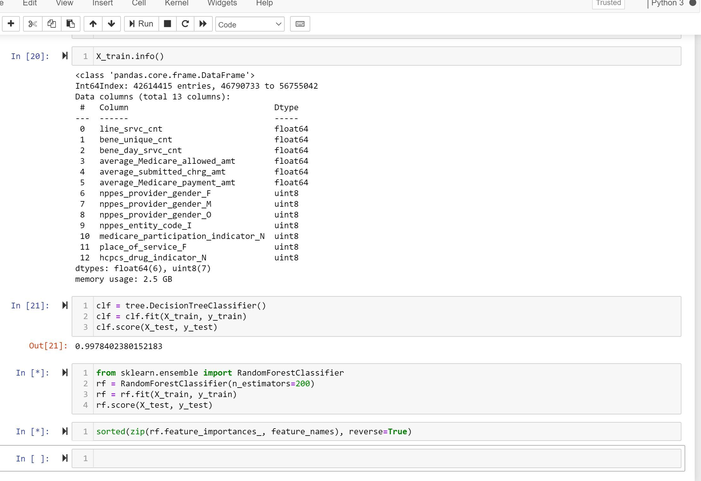

# Final Project

# Medicare FRAUD Detection

#Classify behaviors that lead to fraud using CMS and LEIE datasets

## Project Overview

This project is dedicated to building big data solutions with tangible applications at the intersection of healthcare and insurance industry. This Capstone project will build a Medicare Fraud Detection model to analyze open data and predict/detect the fraudulent Medicare providers based on fraud patterns, anomaly analysis and geo-demographic metrics.

### 1.	Introduction and Background

Healthcare is a major industry in the U.S. with both private and government run programs. The costs of healthcare continue to rise, in part due to the increasing population of the elderly. U.S. healthcare spending from 2012 to 2018 has increased by 31% to reach $3.7 trillion and Medicare spending accounts for 20% of all health-care spending in the U.S. at about $750 billion. The increasing elderly population, along with the rising prices of Medicare, requires cost-cutting solutions, where the elimination of fraud is one way of helping to minimize costs and reduce total payments. 
The impact of healthcare fraud is estimated to be between 3% to 10% of the nation’s total healthcare spending and continuing to adversely impact the Medicare program and its beneficiaries. Government launched multi-agency teams, such as the Medicare Fraud Strike Force (OIG 2007), enacted to help combat fraud, but continued efforts are needed to better mitigate the effects of fraud. These are our project’s basic introduction and background; also it shows that there are huge business opportunities for Medicare Fraud Detection systems.

## 2. Problem Statement

Develop an advanced data science resource that forecasts fraud in the medical insurance industry using incident analysis and geodemographic metrics. This tool can be presented to insurance companies, healthcare providers, patients, pharmacy, and physicians and will allow analytics to gain industry reputation, mitigate rising healthcare costs, and the costly effects of fraud.

### 2.1 Define the problem

Healthcare fraud is a main problem that causes substantial monetary loss in Medicare/Medicaid and insurance industry. The Centers for Medicare and Medicaid Services (CMS) have setup Medicare Part D programs since 2006. CMS relies on it to detect and prevent fraud, waste and abuse in Part D program. But using the traditional methods, the fraud detection is conducted on random samples by human experts. The consequences are the samples might be misleading or manual detection is costly. According to Office of Inspector General report: Since 2006, the Medicare Fraud has rapidly increased. The fraud patterns include the following four types:

•	Fraud by Service Providers (Physicians, hospitals, pharmacies)
•	Fraud by Insurance subscribers (Beneficiaries)
•	Conspiracy Frauds (involved with all parties)

Also along with fraud the following patterns reported by OIG report:

•	Commonly abuse prescribed drugs (opioids) has grown faster than for all Part D drugs
•	Pharmacies with questionable billing raise flags about pharmacy-related fraud schemes 
•	Geographical hotspots from these non-controllable drugs contribute to potential fraudulent activity.

### 2.2 Project Objectives

•	Build a simple Data Model to show the relationships among the different datasets and identify the key feature-sets for fraud detections
•	Build a comprehensive machine learning model to detect fraud pattern based on the different features: Service Providers (Physicians, Pharmacies), Insurance subscribers (Beneficiaries), Geo-demographic and commonly abuse drugs prescriptions 
•	Setup a benchmark metrics to measure and evaluate the experimental result

## 3.	Datasets

#### CMS Part D 
* https://www.cms.gov/Research-Statistics-Data-and-Systems/Statistics-Trends-and-Reports/Medicare-Provider-Charge-Data.html
* Medicare Provider Utilization and Payment Data (Part D Prescriber) 
#### LEIE (OIG)
* https://oig.hhs.gov/exclusions/exclusions_list.asp
* List of Excluded Individuals and Entities (LEIE) database
##### Census, United States 
* https://www.census.gov/data.html
* Center of population data set 
##### BEA U.S. Department of Commerce
* https://www.bea.gov/data/gdp/county-metro-and-other-areas
* Previously published national income estimates 
##### USDA Economic Research Service
* https://www.ers.usda.gov/data-products/county-level-data-sets/documentation/
* Population, migration, rural povertry and well-being 

## 4.	Methodology and Analytics technique

The methodology of this project will follow the below procedures:
•	Data exploration, cleansing and preparation
•	Build a simple data model to join all datasets
•	Feature engineering to choose the effective feature sets for the different fraud patterns
•	Build a machine learning model to detect the different fraud patterns

### Methods Used
* Data Cleaning
* Data Visualization

### Technologies
* Python
* Pandas
* Jupyter
* Javascript
* D3
* HTML
* CSS
* DataTables
* SQL
* Machine Learning Models: 
	- Support Vector Model
	- Logistic Regression 
	- Random Forest

### 4.2	Analytics Technique

### 5. Metrics

* Mike Gleixner - [@gleixners792](https://github.com/gleixners792)
* Clay Hribar - [@OS-Clay](https://github.com/OS-Clay)
* Diego Gonzalez - [@dlg410](https://github.com/dlg410)

